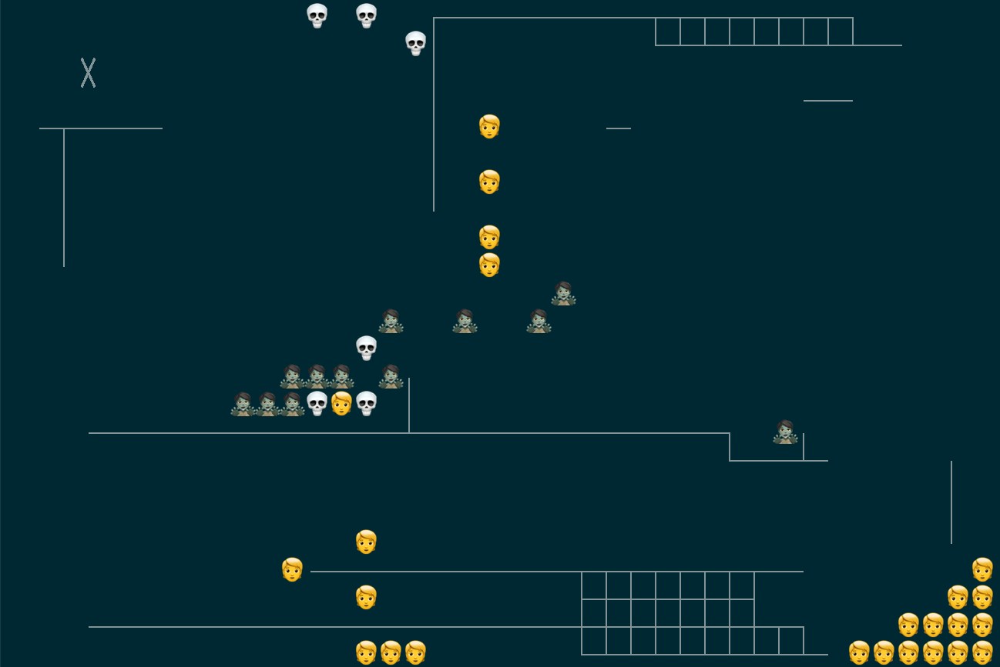

# Zombie simulator

## What it does

It simulates zombies!

Well, it doesn't do a whole lot of that *just* yet. It generates a grid
populated with people, some of whom are zombies and wish nothing more than to
feast on the living. The people don't know how to run away yet, so it's more of
a buffet than an apocalypse.



## How to run it

From the root of this repo, run:

```bash
make zombies
```

So long as you've got Python 3, this should work without any dependencies
outside the standard library. If you particularly feel like running the tests,
you can set that up with `make test`. This is going to assume you're somewhere
with permissions to install dependencies; I'd recommend setting this up in a
virtual environment of some description.
